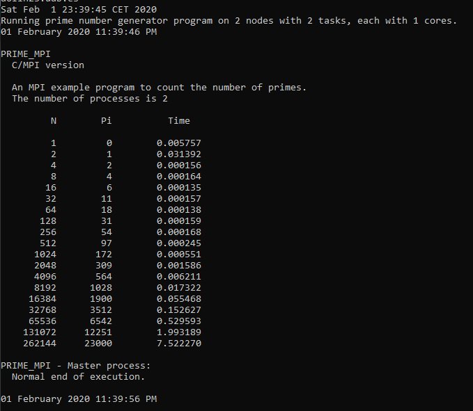
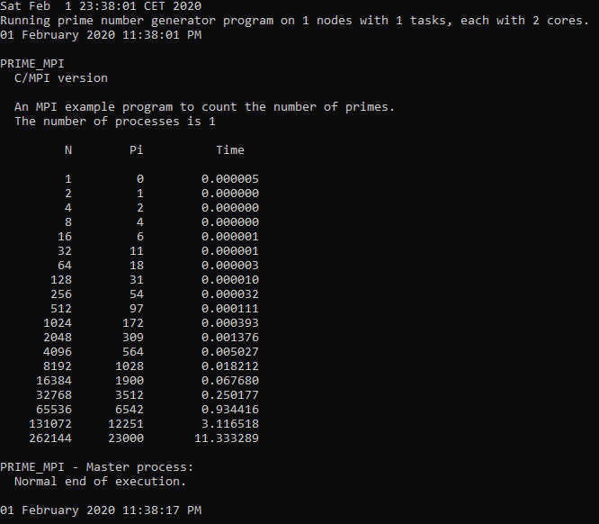
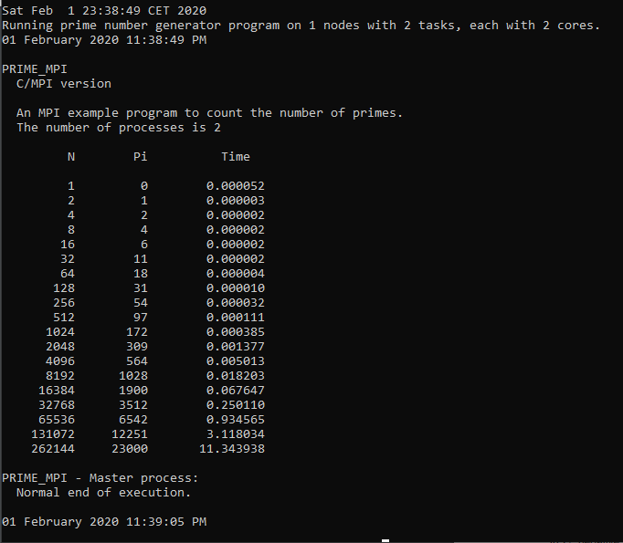
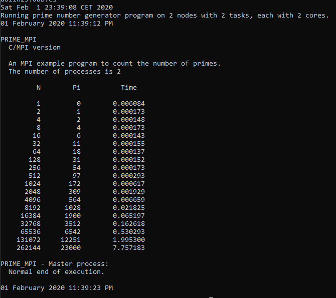
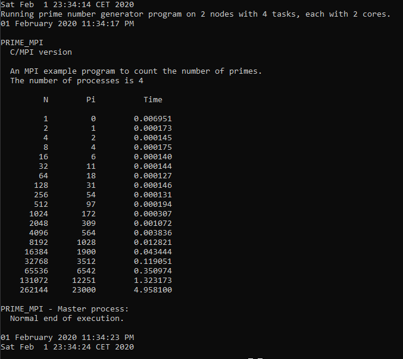

# Improve Bash/Python code performance with The Slurm Workload Manager, an open source job schedule manager and running on a cluster.


## Excercise 1

Write a submit script from scratch – The script should use the following parameters:
• Uses 1 node from the research.q queue
• Creates a file (called text.txt with content: “I have written a
submit script”
• Sleeps for 30 seconds
• Lists the contents of the folder

```{bash}
#!/bin/bash
#SBATCH --job-name=kuba
#SBATCH --partition=research.q
#SBATCH --nodes=1
#SBATCH --output=kuba_slurm_out
# write string to file
echo "I have submitted a script" > text.txt
# sleep 30 seconds
sleep 30 
# list contents of folder
ls
```

Submit the same job from the command line (i.e. all
sbatch options should be added to the command line
together with a script file)

```{bash}
sbatch slurm_file --job-name=kuba --partition=research.q \
                  --nodes=1 --output=kuba_slurm_out
```

Do the same without using the script file (i.e. adding a
--wrap option)

```{bash}
sbatch --wrap="echo 'I have submitted a script' > text.txt;sleep 30;ls;" --job-name=kuba --partition=research.q \
                  --nodes=1 --output=kuba_slurm_out
```


## Excercise 2

We want to sort several text files
(names_0.txt…names_4.txt). Write a solution that uses SLURM job arrays. (Hint: use the sort command from Linux to build your solution)
Useful SLURM variables:
- SLURM_ARRAY_JOB_ID set to the job ID for an array job.
- SLURM_ARRAY_TASK_ID set to the task ID inside an array job.
- SLURM_ARRAY_TASK_MAX/SLURM_ARRAY_TASK_MIN maximum and minimum task IDs in an array job. 


```{bash}
#!/bin/bash
#SBATCH --job-name=kuba_exc2
#SBATCH --partition=research.q
#SBATCH --array=0-4
#SBATCH --output=kuba_array.out
echo $(sort names_$SLURM_ARRAY_TASK_ID.txt) > names_$SLURM_ARRAY_TASK_ID.txt   
```


## Exercise 3

Modify Job4 and turn it into an array job. When does Job5 start now?

Job5 starts after all the array jobs from job4 have been completed or terminated due to the defined depedency (afterany: $jid4)

It will start relatively quicker due to job4 being modified into an array job which splits the tasks in the file.


job4.slurm
```{bash}
#!/bin/bash
#SBATCH --job-name=basic-job
#SBATCH --output=basic-job-output
#SBATCH --partition=research.q
#SBATCH --nodelist=aolin23,aolin24
#SBATCH --array=0-4
# print initial date and time
echo "Start JOB 4 at $(date)"
echo "-------------------------"
# # print name of host
hostname
echo "-------------------------"
# sleep 20 seconds
sleep 20
# print initial date and time
echo "End JOB 4 at $(date)"
```


## Exercise 4

Modify individual job scripts so that each job writes its output in a different file.

Main file (dependencies):
```{bash}
#!/bin/bash
# print initial date and time
echo "Start dependentjob at $(date)"
# first job - no dependencies
dia=$(date)                                                   echo $dia
echo "starting job1"
jid1=$(sbatch --partition=research.q job1.slurm | cut -f 4 -d' ')
echo $jid1
echo "job1 done"
# multiple jobs can depend on a single job
echo "starting job2"
jid2=$(sbatch  --partition=research.q --dependency=afterok:$jid1 job2.slurm | cut -f 4 -d' ')
echo "job2 done"
echo "starting job3"
jid3=$(sbatch  --partition=research.q --dependency=afterok:$jid1 job3.slurm | cut -f 4 -d' ')
echo "job3 done"
echo "starting job4"
# a single job can depend on multiple jobs
jid4=$(sbatch  --partition=research.q --dependency=afterany:$jid2:$jid3 job4.slurm | cut -f 4 -d' ')
echo "job4 done"
echo "starting job5"
jid5=$(sbatch --partition=research.q --dependency=afterany:$jid4 job5.slurm | cut -f 4 -d' ')
echo "job5 done"
# show dependencies in squeue output:
squeue -u $USER -o "%.8A %.4C %.10m %.20E"
# print final date and time
echo "End dependent job at $(date)"    
```

job1.slurm
```{bash}
#!/bin/bash
#SBATCH --job-name=basic-job
#SBATCH --output=output1.out
#SBATCH --partition=research.q
#SBATCH --nodelist=aolin23,aolin24
# print initial date and time
echo "Start JOB 1 at $(date)"
echo "-------------------------"
# print name of host
hostname
echo "-------------------------"
# sleep 10 seconds
sleep 10
# print initial date and time
echo "End JOB 1 at $(date)"
```

job2.slurm
```{bash}
#!/bin/bash
#SBATCH --job-name=basic-job
#SBATCH --output=output2.out
#SBATCH --partition=research.q
#SBATCH --nodelist=aolin23,aolin24
# print initial date and time
echo "Start JOB 2 at $(date)"
echo "-------------------------"
# print name of host
hostname
echo "-------------------------"
sleep 20
# print initial date and time
echo "End JOB 2 at $(date)"
```

job3.slurm
```{bash}
#!/bin/bash
#SBATCH --job-name=basic-job
#SBATCH --output=output3.out
#SBATCH --partition=research.q
#SBATCH --nodelist=aolin23,aolin24
# print initial date and time
echo "Start JOB 3 at $(date)"
echo "-------------------------"
# print name of host
hostname
echo "-------------------------"
# sleep 10 seconds
sleep 10
```

job4.slurm
```{bash}
#!/bin/bash
#SBATCH --job-name=basic-job
#SBATCH --output=output3.out
#SBATCH --partition=research.q
#SBATCH --nodelist=aolin23,aolin24
#SBATCH --array=0-4
# print initial date and time
echo "Start JOB 4 at $(date)"
echo "-------------------------"
# print name of host
hostname
echo "-------------------------"
# sleep 10 seconds
sleep 10
# print initial date and time
echo "End JOB 4 at $(date)" 
```

job5.slurm
```{bash}
#!/bin/bash
#SBATCH --job-name=basic-job
#SBATCH --output=output5.out
#SBATCH --partition=research.q
#SBATCH --nodelist=aolin23,aolin24
# print initial date and time
echo "Start JOB 5 at $(date)"
echo "-------------------------"
# print name of host
hostname
echo "-------------------------"
# sleep 10 seconds
sleep 10
# print initial date and time
echo "End JOB 5 at $(date)" 
```


## Exercise 5

Write a Python script that does the same as the previous bash script. Which approach (bash or Python script) seems easier for you?

*Before running this file please add minconda to make sure the dependencies are satisfied:
```{bash}
$ module add miniconda/3 
```
Python main file (dependencies):
```{bash}
#!/bin/env python3
from datetime import datetime
import subprocess
import re
print("Start dependent job at: ", datetime.today())
# first job - no dependencies
dia=datetime.today()
print(dia)
print("Starting job1")
jid1 = subprocess.check_output("sbatch --partition=research.q job1.slurm".split())
jid1 = ''.join(re.findall(r'\d', str(jid1)))
print(jid1)
jid2 = subprocess.check_output(f"sbatch  --partition=research.q --dependency=afterok:{jid1} job2.slurm".split())
jid2 = ''.join(re.findall(r'\d', str(jid2)))
jid3 = subprocess.check_output(f"sbatch  --partition=research.q --dependency=afterok:{jid1} job3.slurm".split())
jid3 = ''.join(re.findall(r'\d', str(jid3)))
jid4 = subprocess.check_output(f"sbatch  --partition=research.q --dependency=afterany:{jid2}:{jid3} job4.slurm".split())
jid4 = ''.join(re.findall(r'\d', str(jid4)))
jid5 = subprocess.check_output(f"sbatch  --partition=research.q --dependency=afterany:{jid4} job5.slurm".split())
jid4 = ''.join(re.findall(r'\d', str(jid5)))
user = subprocess.check_output(["whoami"]).decode("utf-8").strip()
queueinfo = subprocess.check_output(["squeue", "-u", user, "-o", '"%.8A %.4C %.10m %.20E"']).decode("utf-8")
print(queueinfo.replace('"', ''))
# print final date and time
print(f"End dependent job at {datetime.today()}")
```
## Exercise 6
Write a SLURM script to run an example that uses xargs or parallel commands to parallelize a certain operation. Check that the total execution time is reduced when the operation is parallelized.
Slurm file, no xargs used:
```{bash}
#!/bin/bash
#SBATCH --job-name=no_xargs
#SBATCH --partition=research.q
#SBATCH --output=no_xargs_slurm.out
IFS=" "
if [ ! -d "no_xargs_results" ]
then
	mkdir no_xargs_results
fi
for file in ./references/sequence*
do
	file_no_path="${file##*/}"
	echo "Received file: $file_no_path"
	bwa index -p ./no_xargs_results/${file_no_path%.*} $file 2>/dev/null;
done

```
Using xargs:
```{bash}
#!/bin/bash
#SBATCH --job-name=xargs
#SBATCH --partition=research.q
#SBATCH --output=xargs_slurm.out
IFS=" "
if [ ! -d "xargs_results" ]
then
	mkdir xargs_results
fi
echo -e "1\n2\n3" | xargs -n 1 -P 3 -I {} bash -c "echo 'Received file: sequence{}.fasta'; bwa index -p ./xargs_results/sequence{} ./references/sequence{}.fasta 2>/dev/null;"
```

We run the each of the versions 5 times and compute runtimes using slurms' "sacct" as shown below:
```{bash}
sacct --format=jobid,jobname,nnodes,ncpus,elapsed,state -u biom-2-10 -S2020-01-26-23:35 -E2020-01-26-23:59 -s CD --allocations 
```


Mean program speed over 5 runs:

- no xargs = 19.8

- xargs = 13

Relative performance improvement:

19.8 / 13 ~ 1.52

Using xargs the program was around 1.52 times faster.


## Exercise 7

Complete the SLURM script provided to run the MPI application that computes prime numbers. Execute it with different configurations regarding number of nodes, number of tasks and number of tasks per node and see the performance variations (you could also try out the --ntasks-per-node option)

A) 2 nodes, 2 tasks, 1 core:


B) 1 node, 1 task, 2 cores:


C) 1 node, 2 tasks, 2 cores:


D) 2 nodes, 2 tasks, 2 cores:


E) 2 nodes, 4 tasks, 2 cores:



Comments:

- With two tasks and two cores, increasing number of used nodes from 1 to 2 lead to relative improvement of  ~1.46 (11.34s vs 7.76s) (C vs D)

- Using the same number of cores (2) and further multiplying number of tasks (4) ( E ) leads to further performance incerease, with a relative improvements (2 nodes 4 tasks 2 cores):

~2.28  Over 1 node, 2 task, 2 cores (11.34s vs 4.96s) (C vs E)

~1.56 Over 2 nodes, 2 tasks, 2 cores (7.76s vs 4.96s) (D vs E)

- With the same number of nodes and tasks, increasing number of cores does not lead to any performance improvemments (A, B)
